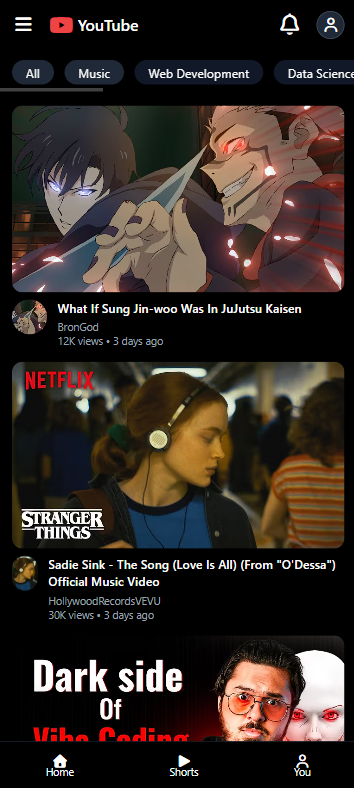
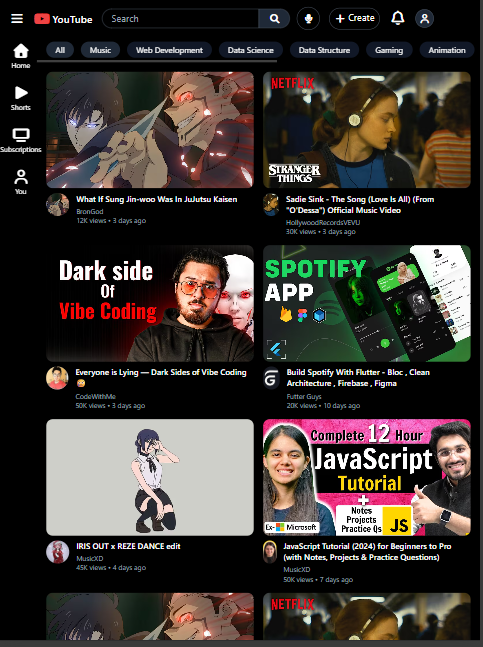
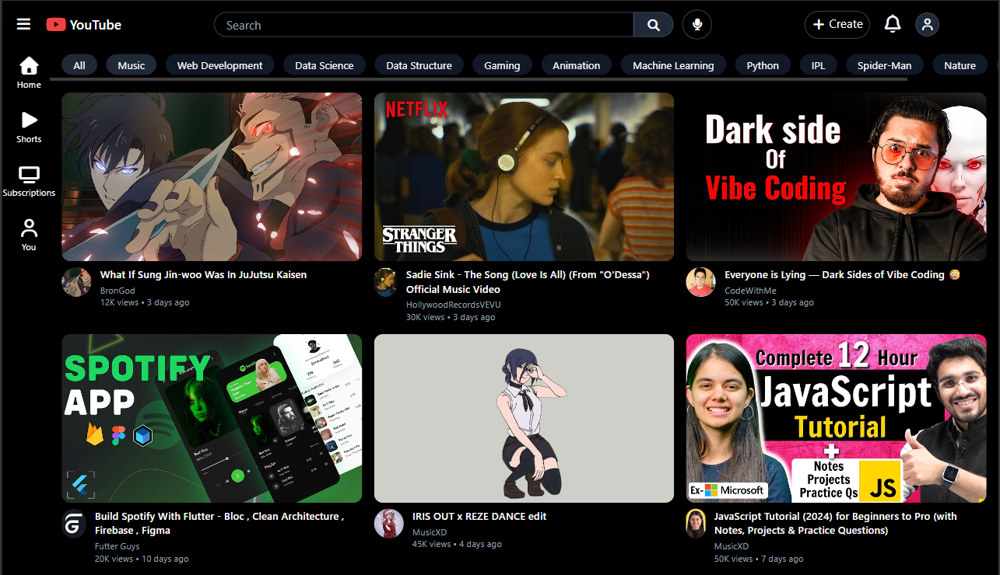

📺 YouTube Clone – Tailwind CSS (Responsive UI)

     

📱 Responsive Preview
## 📱 Responsive Preview

### 📱 Mobile View

### 📱 Tablet View

### 💻 Desktop View

📌 Project Overview

This project is a fully responsive YouTube UI clone built using Tailwind CSS.
The goal of this project was to master real-world responsive layouts without relying on tutorials.

Key Focus Areas:

📐 Layout structure (Header, Sidebar, Main, Footer)

📱 Mobile-first responsive design

🧩 Flexbox & Grid mastery

🎯 Sticky & fixed UI components

🚫 Avoiding overflow & width issues

✨ Features

✅ Sticky top navigation bar

✅ Desktop sidebar navigation

✅ Mobile bottom navigation bar

✅ Horizontally scrollable category bar

✅ Responsive video grid

✅ Video cards with thumbnails & metadata

✅ Clean Tailwind utility-based styling

✅ Mobile / Tablet / Desktop support

🧠 What I Learned

Proper use of flex, grid, and flex-1

Difference between w-full and flex-1

Handling horizontal scroll (overflow-x-auto)

Fixing mobile overflow issues

Sticky vs fixed positioning

Mobile-first responsive thinking

Structuring large UI layouts cleanly

Debugging real responsive design bugs

📂 Folder Structure
youtube-clone-tailwindcss/
│
├── index.html
├── images/
│   ├── thumbnails
│   └── avatars
├── screenshots/
│   ├── mobile.png
│   ├── tablet.png
│   ├── desktop.png
│   └── banner.png
└── README.md

📐 Responsive Breakpoints
Device	Tailwind Prefix
Mobile	Default (<768px)
Tablet	md (≥768px)
Desktop	lg (≥1024px)
🛠️ Tech Stack
Technology	Purpose
HTML5	Structure
Tailwind CSS	Styling & Responsive Design
Font Awesome	Icons
Git & GitHub	Version Control
🚀 Future Improvements

🔹 Add JavaScript interactions

🔹 Search functionality

🔹 Video hover preview

🔹 Dark / Light mode toggle

🔹 Convert UI to React

🔹 Deploy using GitHub Pages / Vercel

🧑‍💻 Author

Bheemankar Vijay
🎓 AIML Student | Frontend Learner
📅 Project Year: 2025
🔗 GitHub: https://github.com/BheemankarVijay